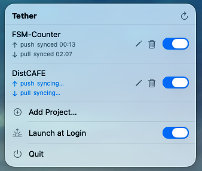

# Tether

A tiny macOS menu-bar app that keeps a local project in sync with a remote host over `rsync` + SSH.

<p align="center">
  
</p>

## What it does

- **Push** code to the remote on every save — debounced, triggered by filesystem events.
- **Pull** logs (or any output) back on a configurable interval.
- Per-project, per-direction toggles. Multiple push and pull subpaths per project.
- Reuses each pushed folder's `.gitignore` as the rsync exclude list.
- Optional **Launch at Login** so it's running before you open your editor.
- Lives in the menu bar. No Dock icon, no window clutter.

## Requirements

- macOS 14+
- Swift 5.10 (Xcode 15.3+ or matching CLI)
- `/usr/bin/rsync` and `ssh` on `PATH`
- An SSH identity that reaches your remote non-interactively

## Build

```sh
./scripts/build-app.sh         # release → build/Tether.app
./scripts/build-app.sh debug   # debug build
open build/Tether.app
```

The script runs `swift build`, assembles a proper `.app` bundle (so `LSUIElement` is honored), and ad-hoc code-signs it.

## Configuration

Projects live at `~/Library/Application Support/Tether/config.json`. Edit them from the menu bar (**Add Project…** or the pencil icon). Each project has:

- a local root and a remote root (e.g. `user@host:/srv/myapp`)
- one or more push subpaths and pull subpaths, each relative to the roots
- per-direction enable toggles and optional per-direction excludes
- a pull interval, optional SSH identity file, and optional extra `rsync` args

## Layout

```
Sources/Tether/
  TetherApp.swift       # @main entry
  Models/               # ProjectConfig, status types
  Store/                # ConfigStore, LaunchAtLogin
  Sync/                 # SyncEngine, SyncWorker, RsyncRunner, FileWatcher, IgnoreRules
  UI/                   # MenuBarContent, ProjectEditorView
Resources/Info.plist    # bundle metadata (LSUIElement = true)
scripts/build-app.sh    # build + bundle script
```
